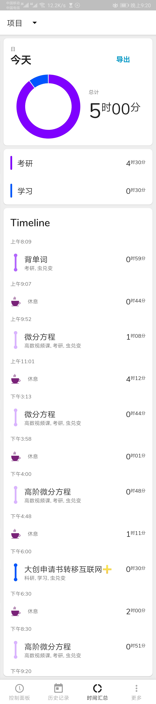
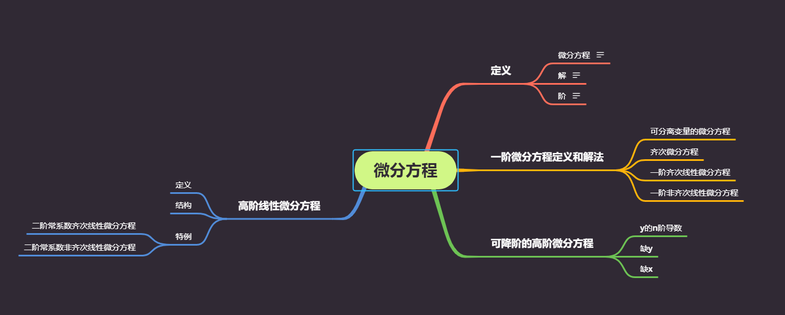

### 时间记录

### 英语

- 追上了之前的单词进度
- 添加20词

### 高数学习

- 微分方程基础课程，前半段听起来还好。高阶微分方程爆炸。熟悉题目估计要多看一看

- 基本知识体系

  

### 其他

- 大创项目要参加互联网+，申请还没上交
- 剩下都是在跟智齿作斗争

### 明日计划

- 高数微分方程-汤神1800题基础题，如果能做下去做完
- 英语单词20个
- 准备开始英语的复习，先从语法开始（基础太差，要恶补）